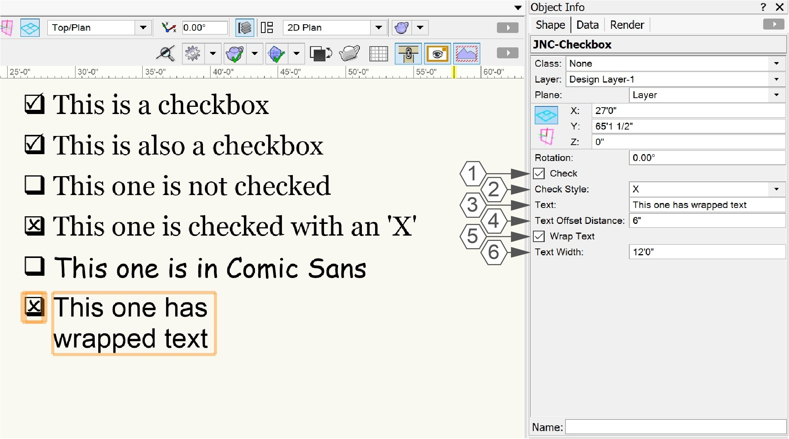

# JNC-Checkbox

Plug-in Object

## Icon

## Version

1.0.1 - 1/25/2025

This plug-in is written in Vectorscript (Pascal) and can be used in any version of [Vectorworks](https://www.vectorworks.net) 2019 or newer.

## Description

The plug-in object creates a text based checkbox with description text and can be "checked" by double-clicking the object.

## Instructions

1. Set the initial font, text style, and text size settings using the **Text** menu.
2. Activate the **JNC-Checkbox** tool.
3. Place the **JNC-Checkbox** in the desired location. The center of the checkbox is the origin point of the object.
4. Choose a **Check Style**, either a "checkbox" or an "X".
5. Enter description **Text**. This text will appear next to the Checkbox.
6. Enter a **Text Offset Distance**. This will default to 3" in imperial units and 50mm in metric.
7. Choose whether to **Wrap Text** and set a **Text Width**. The **Text Width** will default to 12' in imperial units and 10m in metric.
8. Double-click the **JNC-Checkbox** object or check the **Check** in the **Object Info Palette** to "check" the Checkbox.

## Object Info Palette Parameters

1. **Check:** Check this box to place a "check" in the Checkbox of the **JNC-Checkbox** object.
2. **Check Style:** Choose between using a checkmark or an X in the Checkbox when the object is "checked."
3. **Text:** Enter description text. This text will appear to the right of the Checkbox.
4. **Text Offset Distance:** This value determines the distance between the Checkbox and the description text. This value will need to change depending on the text size of the **JNC-Checkbox** object. Larger text sizes will need larger **Text Offset Distance** settings.
5. **Wrap Text:** Check this box to force the description text to "wrap" lines based on the **Text Width** parameter. The Checkbox will appear centered on the top line of the description text.
6. **Text Width:** This value will determine the width of the description text when the **Wrap Text** box is checked. 

## Windows vs. Mac Appearance

This tool utilizes the Wingdings font to create the Checkbox and check graphics. Wingdings *should* be installed by default on all Windows machines, but is not installed on Mac platforms. On Mac platforms, this tool instead uses the Webdings font.  This will lead to subtle differences in the appearance of the Checkbox graphics.

### Windows Example:

### Mac Example:

## Tips and Tricks

- The font, font style, and size of the description text can be changed by selecting the **JNC-Checkmark** object and using the **Text** menu. Font and font style will not affect the Checkbox component.
- The color of the description text and Checkbox is determined by the Pen Color settings in the **Attributes** palette, and the Fill Style and Fill Color determine the color and style of the space behind the text.
- The tool uses plug-in strings to determine the exact font and characters to use for the Checkbox component of the **JNC-Checkbox** object. These can be changed following the instructions in the [Localization Instructions](#localization-instructions) section below. Keep in mind that this will affect **JNC-Checkbox** objects on your installation of Vectorworks only, other users opening your drawing will see the default characters unless they have also updated the plug-in strings.

## Installation Instructions

There are two methods of installation, direct download of the plug-in or through the **JNC Tools Free Manager** plug-in.

### Direct Download:

1. Download [source plug-in file](JNC-Checkbox.vso)
2. Place downloaded file inside the **Vectorworks User Folder** within the **Plug-ins** directory
3. Restart Vectorworks

### JNC Tools Free Manager

1. Run the [**JNC Tools Free Manager**](https://jncogs.github.io/JNC-Tools-Manager-Free/) menu command
2. Select the **JNC-Checkbox** command
3. Press the **Install / Update** button
4. Press **Close** to close the dialog box
5. Restart Vectorworks

## Adding the Plug-in to your Workspace

1. Open the **Workspace Editor** by going to **Tools - Workspaces - Edit Current Workspace**
2. Select the **Tools** tab
3. In the box on the left, find and expand the **JNC** category
4. In the box on the right, find a suitable tool set to place the tool in, such as **Basic** or **Dims/Notes**
5. Click and drag the **JNC-Checkbox** tool from the box on the left to the desired tool set in the box on the right
6. Click **OK** to close the editor

## Localization Instructions

The plug-in can be localized to your native language without having access to the source code.  This can be achieved by following the instructions below:

1. Open the **Plug-in Manager** by going to **Tools - Plug-ins - Plug-in Manager**
2. Select the **Third-party Plug-ins** tab
3. Select the **JNC-Checkbox** tool
4. Click the **Customize** button
5. Select the **Strings** tab
6. Double-click a category, such as **Dialog Strings**
7. Select a string to edit and press the **Edit** button
8. Write a new string and press the **OK** button until you are back to the **Plug-in Manager**

The categories for this plug-in are as follows:

- **3000** - *Misc Strings*: These strings are used to determine the font and characters on Windows machines.
    - **3000**: Font used for the Checkbox. This is "*Wingdings*" by default.
    - **3001**: Character used for the Checkbox. This is "*q*" by default.
    - **3002**: Font used for the Check marks. This is "*Wingdings 2*" by default.
    - **3003**: Character used for the "Checkmark" **Check Style**. This is "*P*" by default.
    - **3004**: Character used for the "X" **Check Style**. This is "*O*" by default.
- **4000** - *Mac Font Strings*: These strings are used to determine the font and characters on Mac machines.
    - **4000**: Font used for the Checkbox and Check marks. This is "*Webdings*" by default.
    - **4001**: Character used for the "Checkmark" **Check Style**. This is "*a*" by default.
    - **4002**: Character used for the Checkbox. This is "*c*" by default.
    - **4003**: Character used for the "X" **Check Style**. This is "*r*" by default.

## Release Notes

| Date | Version | Note |
| :---: | :---: | :--- |
| 01/25/2025 | 1.0.0 | Initial Release |
| 01/25/2025 | 1.0.1 | Added Mac font functionality using Webdings |

## Known Bugs

No Known Bugs

## Feature Requests

| Date Logged | Request |
| :---: | :--- |
| 01/25/2025 | Incorporate a control point for Text Width parameter |

## License

Copyright (c) Jesse Cogswell (JNC Tools)

Permission is hereby granted, free of charge, to any person or organization
obtaining a copy of this software (the "User") and associated documentation files (the "Software"),
to use, reproduce, distribute, execute, and transmit the Software.

The User is not permitted to modify or attempt to reverse engineer the source code.  The User may
localize the Software using approved methods from within the Vectorworks software.

THE SOFTWARE IS PROVIDED "AS IS", WITHOUT WARRANTY OF ANY KIND, EXPRESS OR
IMPLIED, INCLUDING BUT NOT LIMITED TO THE WARRANTIES OF MERCHANTABILITY,
FITNESS FOR A PARTICULAR PURPOSE, TITLE AND NON-INFRINGEMENT. IN NO EVENT
SHALL THE COPYRIGHT HOLDERS OR ANYONE DISTRIBUTING THE SOFTWARE BE LIABLE
FOR ANY DAMAGES OR OTHER LIABILITY, WHETHER IN CONTRACT, TORT OR OTHERWISE,
ARISING FROM, OUT OF OR IN CONNECTION WITH THE SOFTWARE OR THE USE OR OTHER
DEALINGS IN THE SOFTWARE.